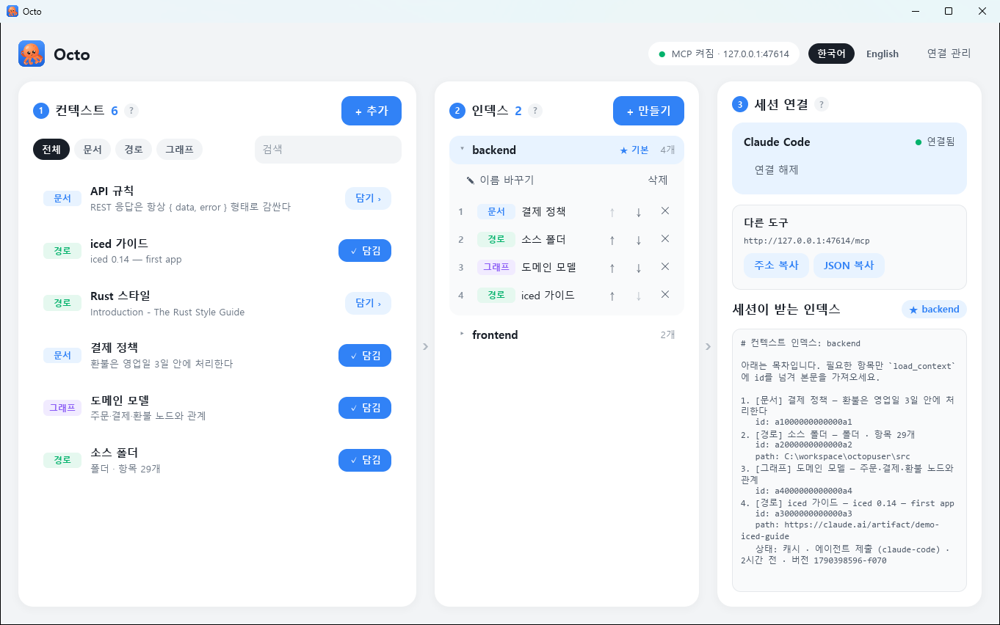
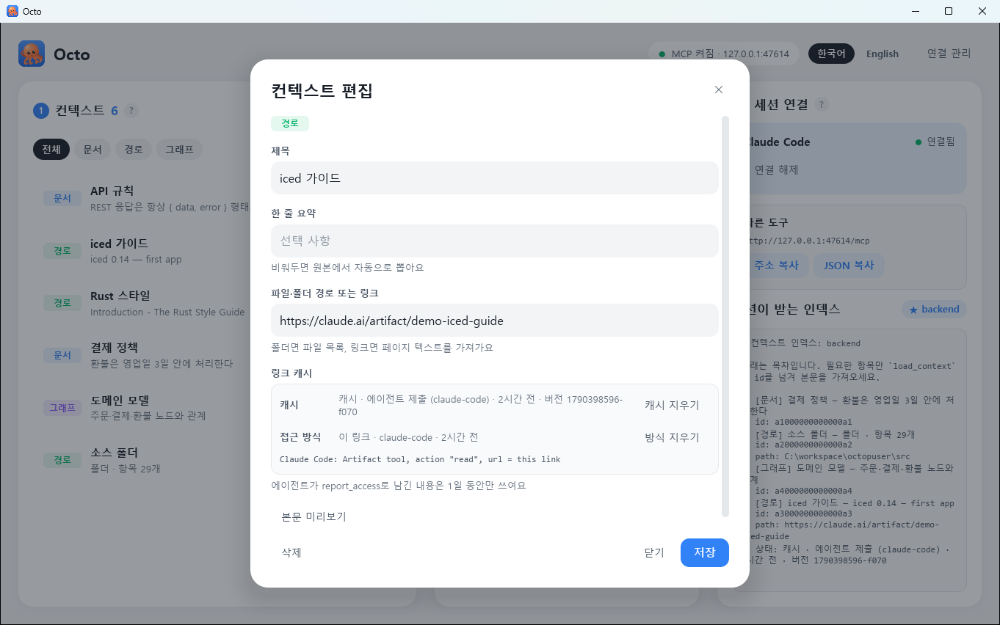

<p align="center">
  
</p>

<h1 align="center">Octo</h1>

<p align="center">
  <b>AI 코딩 에이전트를 위한 로컬 컨텍스트 인덱서</b><br>
  컨텍스트는 한 번만 등록하고, 인덱스로 엮고, 에이전트는 MCP로 필요한 것만 가져갑니다.
</p>

<p align="center">
  <a href="README.md">English</a> · <b>한국어</b>
</p>

<p align="center">
  
  
  
</p>

---

## 목차

- [왜 Octo인가](#왜-octo인가)
- [동작 방식](#동작-방식)
- [기능](#기능)
- [시작하기](#시작하기)
- [에이전트 연결](#에이전트-연결)
- [MCP 도구](#mcp-도구)
- [링크 캐시](#링크-캐시)
- [가져오기와 내보내기](#가져오기와-내보내기)
- [데이터와 설정](#데이터와-설정)
- [보안](#보안)
- [구조](#구조)
- [기여하기](#기여하기)
- [라이선스](#라이선스)

## 왜 Octo인가

Claude Code, Cursor, Codex 같은 AI 코딩 에이전트는 세션을 새로 열 때마다 아무것도 모르는 상태로 시작합니다.
그래서 같은 설명을 매번 반복하게 됩니다. *결제 정책은 이 문서에 있고, 소스는 저 폴더에 있고, 도메인 모델은 neo4j에 있다* 같은 설명입니다.

흔히 쓰는 우회책에는 저마다 대가가 있습니다.

- **프롬프트에 전부 붙여 넣으면** 본 작업을 시작하기도 전에 컨텍스트 창이 찹니다.
- **일부를 빼먹으면** 에이전트가 추측하는데, 그 추측은 자주 틀립니다.
- **문서를 저장소마다 복사해 두면** 복사본이 원본과 조용히 어긋납니다.

Octo는 세 가지 원칙으로 다르게 접근합니다.

1. **목차가 먼저입니다.** 에이전트는 먼저 제목과 한 줄 요약으로 된 가벼운 목차를 받고, 필요한 항목만 본문을 가져갑니다.
2. **원본을 따라갑니다.** 경로 컨텍스트는 사본을 저장하지 않고 원본 파일·폴더·URL을 가리킵니다. 그래서 에이전트는 늘 최신 내용을 봅니다.
3. **오래된 컨텍스트는 주지 않습니다.** 최신임을 확인할 수 없는 내용은 출처를 밝히거나 아예 내주지 않습니다. 낡은 내용을 모르고 쓰게 두지 않습니다.

## 동작 방식

```text
 ┌──────────────── Octo (트레이 앱) ───────────────┐
 │                                                 │
 │  컨텍스트              인덱스                   │        ┌──────────────┐
 │  ├─ 문서   결제 정책 ─▶ backend ★ (기본)        │  MCP   │ Claude Code  │
 │  ├─ 경로   src/     ─▶  1. 결제 정책            │◀──────▶│ Cursor       │
 │  ├─ 경로   https://…    2. 소스 폴더            │  HTTP  │ Codex …      │
 │  └─ 그래프 도메인   ─▶ frontend                 │        └──────────────┘
 │                                                 │
 └──────────────────── ~/.octo ────────────────────┘
```

1. **컨텍스트를 등록합니다.** 앱에서 문서를 쓰거나, 경로나 URL을 가리키거나, Cypher 쿼리를 저장합니다.
2. **인덱스를 구성합니다.** 프로젝트에 필요한 컨텍스트만 골라 담고 순서를 정합니다.
3. **한 번만 연결합니다.** 에이전트는 `get_index`로 목차를 보고, 필요한 항목만 `load_context`로 가져갑니다.

이 흐름이 한 화면에 모두 담겨 있습니다.

<p align="center">
  
</p>

## 기능

### 세 종류의 컨텍스트

| 종류 | 등록하는 것 | 에이전트가 받는 것 |
|---|---|---|
| **문서** | 앱에서 쓴 Markdown, 또는 불러온 `.md` 파일 | 본문 |
| **경로** | 파일 · 폴더 · 웹 링크 | 파일 내용 / 폴더 파일 목록 / 페이지 텍스트 |
| **그래프** | neo4j 연결과 저장한 Cypher 쿼리 | 쿼리 결과 (읽기 전용으로 실행) |

- 한 줄 요약을 비워 두면 원본에서 자동으로 만듭니다. 문서는 첫 줄, 링크는 페이지 제목, 그래프는 노드·관계 수를 씁니다.
- 원본을 읽을 수 없으면 목차에 **연결 끊김**과 그 사유를 표시합니다.

### 인덱스

- 한 컨텍스트를 여러 인덱스에 담을 수 있습니다.
- **기본 인덱스**를 정하면 새 세션이 그 인덱스로 시작합니다.
- 에이전트는 세션 도중 `use_index`로 인덱스를 바꿀 수 있습니다. 이 전환은 그 세션에만 적용됩니다.

### 주소 하나로 끝나는 MCP

- Octo는 로컬에 [Streamable HTTP](https://modelcontextprotocol.io/specification/2025-06-18/basic/transports) MCP 서버를 엽니다. 주소는 `http://127.0.0.1:47614/mcp`입니다.
- Claude Code는 클릭 한 번으로 사용자 범위에 등록돼서 모든 프로젝트에서 쓸 수 있습니다.
- 다른 에이전트는 JSON 설정 한 조각을 MCP 설정에 붙여 넣으면 됩니다.

### 링크 캐시

- claude.ai 아티팩트, Google 문서, Confluence처럼 로그인이 필요한 페이지는 Octo가 직접 가져올 수 없습니다.
- 에이전트가 자기 도구로 이런 페이지를 읽는 데 성공하면 그 결과를 Octo에 보고할 수 있습니다.
- Octo는 **어떻게 열었는지**와 **무엇이 들어 있었는지**를 기억해서, 다음 세션이 같은 시행착오를 반복하지 않게 합니다. 자세한 내용은 [링크 캐시](#링크-캐시)를 보세요.

### 상주하는 데스크톱 앱

- 창을 닫아도 시스템 트레이에 남아 MCP 서버를 계속 제공합니다.
- 인스턴스는 하나만 뜹니다. 다시 실행하면 이미 떠 있는 창을 앞으로 가져옵니다.
- 비밀번호는 OS 키체인(Windows 자격 증명 관리자 / macOS Keychain)에 보관합니다.
- 화면은 한국어와 영어를 지원합니다.

## 시작하기

### 요구 사항

| 항목 | 필요한 경우 |
|---|---|
| [Rust](https://rustup.rs) (stable, 2024 edition) | 빌드 |
| [Claude Code](https://docs.anthropic.com/en/docs/claude-code) CLI (`claude`) | *선택.* 클릭 한 번으로 MCP 등록 |
| HTTP API를 켠 [neo4j](https://neo4j.com) | *선택.* 그래프 컨텍스트 |

### 빌드와 실행

```bash
git clone <repository-url>
cd octopuser
cargo run --release
```

첫 빌드는 몇 분 걸립니다.

> **창이 뜨지 않거나 그래픽 에러가 나면**
> 소프트웨어 렌더러로 실행하세요.
> `ICED_BACKEND=tiny-skia cargo run --release`
> PowerShell에서는 `$env:ICED_BACKEND = "tiny-skia"`를 먼저 실행합니다.

### 처음 쓰는 순서

앱은 한 화면이고, 작업이 왼쪽에서 오른쪽으로 흘러갑니다.

```text
① 컨텍스트 ──▶ ② 인덱스 ──▶ ③ 세션 연결
```

| 패널 | 보여주는 것 | 할 수 있는 일 |
|---|---|---|
| **① 컨텍스트** | 등록한 모든 컨텍스트를 종류 배지, 한 줄 요약과 함께 보여줍니다. 종류별로 거르거나 검색할 수 있습니다. | 컨텍스트를 추가·편집하고, **담기 ›**로 선택한 인덱스에 담습니다. |
| **② 인덱스** | 모든 인덱스를 접었다 펼 수 있는 목록으로 보여줍니다. ★ 기본 인덱스가 표시됩니다. | ↑ ↓로 순서를 바꾸고, ✕로 빼고, 인덱스 이름을 바꾸거나 삭제합니다. |
| **③ 세션 연결** | Claude Code 연결 상태, MCP 주소, 그리고 세션이 실제로 받는 목차의 실시간 미리보기를 보여줍니다. | Claude Code를 연결하거나 해제하고, 다른 도구용 주소나 JSON을 복사합니다. |

1. **① 컨텍스트**에서 **+ 추가**를 눌러 문서, 경로, 그래프 쿼리 중 하나를 등록합니다.
2. **② 인덱스**에서 인덱스를 만들고 컨텍스트를 담습니다. **★ 기본으로**를 누르면 기본 인덱스가 됩니다.
3. **③ 세션 연결**에서 Claude Code는 **한 번에 연결**을 누르고, 다른 에이전트는 JSON을 복사합니다.
4. 에이전트 세션을 새로 열면 바로 `get_index`를 쓸 수 있습니다.

## 에이전트 연결

**Claude Code**: 앱에서 **한 번에 연결**을 누릅니다. 아래 명령을 실행한 것과 같습니다.

```bash
claude mcp add --transport http --scope user octo http://127.0.0.1:47614/mcp
```

**다른 MCP 클라이언트**: 클라이언트의 MCP 설정에 아래 내용을 추가합니다.

```json
{
  "mcpServers": {
    "octo": { "type": "http", "url": "http://127.0.0.1:47614/mcp" }
  }
}
```

**인덱스 선택 순서**: 세션이 쓰는 인덱스는 아래 순서로 정해집니다.

1. 그 세션에서 `use_index`로 고른 인덱스
2. 주소에 붙인 `?index=<이름>`. 프로젝트마다 인덱스를 고정할 때 씁니다. 예: `http://127.0.0.1:47614/mcp?index=backend`
3. 앱에서 정한 기본 인덱스

## MCP 도구

| 도구 | 인자 | 설명 |
|---|---|---|
| `get_index` | 없음 | 현재 인덱스의 목차. id, 종류, 제목, 한 줄 요약, 상태가 나옵니다. |
| `load_context` | `id` | 컨텍스트 하나의 본문 |
| `list_indexes` | 없음 | 쓸 수 있는 인덱스 목록. 현재 인덱스와 기본 인덱스를 표시합니다. |
| `use_index` | `name` | 이 세션에서만 인덱스를 바꿉니다. |
| `report_access` | `id`, `method`, `content?`, `version?` | Octo가 가져오지 못한 링크를 에이전트가 어떻게 열었는지, 필요하면 읽은 본문까지 남깁니다. |
| `add_context` | `title`, `summary?`, `body` 또는 `path` | 다음 세션도 알아야 할 내용을 현재 인덱스에 새 컨텍스트로 남깁니다. 인덱스에 같은 제목이 있으면 거절합니다. |
| `update_context` | `id`, `title?`, `summary?`, `body?`, `path?` | 에이전트가 만든 컨텍스트를 고칩니다. 사람이 앱에서 한 번 저장하면 더는 에이전트가 바꿀 수 없습니다. |
| `delete_context` | `id` | 에이전트가 만든 컨텍스트를 지우고 모든 인덱스에서 뺍니다. |
| `create_index` | `name` | 빈 인덱스를 만들고 세션이 그 인덱스를 쓰게 합니다. |
| `update_index` | `name?`, `new_name?`, `add?`, `remove?` | 인덱스에 기존 컨텍스트를 넣거나 빼고, 이름을 바꿉니다. 빼기는 인덱스나 컨텍스트가 에이전트 것일 때만, 이름 바꾸기는 에이전트가 만든 인덱스만 됩니다. |
| `delete_index` | `name` | 에이전트가 만든 인덱스를 지웁니다. 담겨 있던 컨텍스트는 남습니다. |

| `export_indexes` | `indexes?`, `all?`, `path?`, `include_secrets?`, `attach_large?` | 인덱스를 `.octo.zip`으로 내보냅니다. [가져오기와 내보내기](#가져오기와-내보내기) 참고. |
| `import_indexes` | `path`, `dry_run?` | `.octo.zip`을 가져옵니다. 에이전트는 먼저 `dry_run` 요약을 사용자에게 보여주도록 안내받습니다. |

에이전트는 자기가 만든 것만 이름을 바꾸거나 지울 수 있습니다. 사람이 앱에서 컨텍스트나 인덱스를 고치면 사람 것이 되고, 에이전트는 대신 사용자에게 알리도록 안내받습니다.

에이전트가 `get_index`로 받는 목차는 이런 모양입니다.

```text
# 컨텍스트 인덱스: backend

1. [문서] 결제 정책 — 환불은 영업일 3일 안에 처리한다
   id: 18d8cd425d413f44
2. [경로] iced ref — iced 첫 앱 만들기
   id: 18d8cdc016e7bedc
   path: https://claude.ai/artifact/…
   상태: 캐시 · 에이전트 제출 (claude-code) · 2시간 전 · 버전 1790398596-f070
```

## 링크 캐시

링크 캐시는 두 가지를 따로 저장합니다. 두 정보가 유효한 기간이 다르기 때문입니다.

### 1. 접근 방식: 링크를 어떻게 여는가

- 에이전트가 `report_access`로 방식을 남깁니다. 예: *"Claude Code: Artifact 도구에 action `read`와 이 URL을 넘긴다."*
- 클라이언트마다 쓸 수 있는 도구가 달라서, 보고한 클라이언트 이름도 함께 저장합니다.
- 방식은 아래 순서로 찾습니다.
  1. 이 URL에 대해 보고된 방식
  2. 같은 도메인의 다른 URL에 대해 보고된 방식
  3. 기본 규칙 (claude.ai, Google 문서, Atlassian)
- 접근 방식은 만료되지 않습니다.
- 링크를 가져오지 못하면 에러와 함께 이 방식을 힌트로 줍니다. 다음 에이전트는 헤매지 않고 효과가 있던 방법을 바로 씁니다.

### 2. 조회 결과: 링크에 무엇이 들어 있었나

| 원천 | 1일 이내 | 1일이 지나면 |
|---|---|---|
| **Octo가 가져옴** | 읽을 때마다 `ETag` / `Last-Modified`로 다시 확인합니다. `304`가 오면 캐시본을 쓰고 유효기간을 갱신합니다. | 삭제합니다. 다음에 읽을 때 다시 가져옵니다. |
| **에이전트가 제출함** | `캐시 · 에이전트 제출 (claude-code) · 2시간 전 · 버전 …`처럼 출처를 붙여 내주고, 에이전트에게 버전을 확인하라고 안내합니다. | 삭제하고 **더는 내주지 않습니다.** 접근 방식만 남습니다. |

- **오래된 내용은 내주지 않습니다.** 1일이 지난 캐시는 원본에 접근할 수 없더라도 제공하지 않습니다.
- **실패도 10분 동안 기억합니다.** 그동안은 다시 시도하지 않아서, 깨진 링크 때문에 `get_index`가 타임아웃을 반복해서 기다리지 않습니다.
- **편집에 맞춰 정리합니다.** 컨텍스트를 지우거나 URL을 바꿨을 때, 옛 URL을 쓰는 컨텍스트가 더 없으면 그 조회 결과를 버립니다. 접근 방식은 다른 링크가 쓸 수 있으므로 남깁니다.
- **앱에서 보고 지울 수 있습니다.** 링크 컨텍스트를 열면 캐시 상태가 보이고, **캐시 지우기**와 **방식 지우기** 버튼이 있습니다.

<p align="center">
  
</p>

## 가져오기와 내보내기

팀원과 인덱스 공유, 다른 PC로 이전, 백업을 `.octo.zip` 파일 하나로 합니다.

- **내보내기**는 인덱스 패널의 **⇪ 내보내기**나 헤더의 **전체 내보내기**로 합니다. 에이전트는 `export_indexes`를 씁니다.
- **담기는 것:** 인덱스, 목차의 컨텍스트, 문서 본문, 그래프 연결, 에이전트가 남긴 링크 접근 방식입니다.
  - 경로 컨텍스트가 가리키는 파일·폴더도 첨부합니다. `.git`, `target`, `node_modules`, `.idea`는 뺍니다.
  - 컨텍스트 하나의 첨부가 100MB를 넘으면 먼저 묻습니다. 에이전트는 `attach_large`를 주지 않으면 경로만 담습니다.
  - 링크(URL)는 주소만 담습니다. 링크 본문 캐시는 1일이면 만료되므로 뺍니다.
  - 홈 폴더 아래 경로는 `~/…`로 적어서 다른 PC·OS에서도 풀립니다.
- **비밀번호**는 **전체 내보내기**에서 체크했을 때만 담기고, 이때 **평문**으로 들어가니 파일을 남에게 보내지 마세요.
- **가져오기**는 헤더의 **가져오기**나 `import_indexes`로 합니다. 새로·갱신·그대로 개수, 이름이 바뀔 인덱스, 첨부 크기 요약을 먼저 보여줍니다.
  - 경로는 이 PC에 원본이 있으면 원본을, 없으면 `~/.octo/attachments/<id>/`에 푼 첨부본을 가리킵니다.
  - 같은 이름 인덱스가 있으면 새 이름(`이름-2`)으로 가져옵니다. 내 인덱스는 덮지 않습니다.
  - 같은 id 컨텍스트는 내용이 같으면 그대로 두고, 다르면 갱신합니다.
  - 가져온 것은 모두 내 소유가 되어 에이전트가 고치거나 지울 수 없습니다.
- **되돌리기.** 가져올 때마다 직전 상태를 `~/.octo/backups/`에 스냅샷으로 남깁니다(최근 5개). 결과 화면의 **되돌리기**로 그대로 복원합니다.

## 데이터와 설정

모든 데이터는 내 컴퓨터에만 있습니다.

- 기본 위치는 `~/.octo`입니다.
- 다른 위치를 쓰려면 `OCTO_HOME` 환경 변수를 지정합니다.

```text
~/.octo/
├─ config.json            MCP 포트, 기본 인덱스, 언어
├─ contexts/<id>.json     컨텍스트 정의 (문서 본문은 <id>.md)
├─ indexes/<이름>.json    인덱스와 담긴 순서
├─ connections/           neo4j 접속 정보 (비밀번호 제외)
├─ attachments/<id>/      가져올 때 원본이 없어 푼 첨부 파일
├─ backups/               가져오기 직전 스냅샷 (최근 5개)
└─ cache/
   ├─ access.json         접근 방식 (URL별 · 도메인별)
   └─ results/            링크 조회 결과 (1일 뒤 삭제)
```

- **파일이 원본(Source of Truth)입니다.** 앱은 바뀐 내용을 바로 파일에 쓰고, MCP 서버도 같은 파일을 읽습니다.
- **재시작이 필요 없습니다.** 앱에서 고친 내용은 에이전트에게 바로 반영됩니다.

## 보안

- **로컬 전용입니다.** MCP 서버는 `127.0.0.1`에만 바인딩합니다.
- **브라우저 요청을 제한합니다.** 브라우저에서 온 요청은 로컬 `Origin`만 허용합니다. DNS rebinding 공격을 막기 위해서입니다.
- **그래프는 읽기 전용입니다.** Cypher는 읽기 전용 트랜잭션(`access-mode: READ`)으로 실행합니다.
- **비밀번호는 OS 키체인에 둡니다.** neo4j 비밀번호는 데이터 폴더에 두지 않습니다. 키체인을 쓸 수 없을 때만 데이터 폴더에 파일로 둡니다.
- **에이전트가 제출한 내용은 신뢰하지 않는 것으로 다룹니다.** 항상 출처를 붙이고, 1일 뒤 만료되며, 앱에서 언제든 지울 수 있습니다.

## 구조

```text
src/
├─ main.rs         진입점: 중복 실행 확인 → 저장소 → MCP 서버 → GUI 데몬
├─ mcp.rs          Streamable HTTP MCP 서버 (/mcp)와 세션 상태
├─ core/           컨텍스트 도메인. UI와 MCP가 함께 씀
│  ├─ store.rs     파일 저장소: 컨텍스트, 인덱스, 연결, 설정
│  ├─ content.rs   본문 로드와 목차 생성
│  ├─ web.rs       링크 가져오기, HTML → 텍스트, 조건부 요청
│  ├─ cache.rs     링크 접근 방식 · 조회 결과 캐시
│  ├─ graph.rs     neo4j HTTP 트랜잭션 API
│  └─ secret.rs    OS 키체인 비밀번호 보관
├─ daemon/         상주 동작: 중복 실행 방지, 트레이, Claude Code 등록
├─ ui/             iced GUI: 상태(app.rs), 화면(view/), 디자인(theme, widgets)
└─ i18n.rs         한국어 / English 문장
```

Octo는 다음 라이브러리로 만들었습니다.

- GUI: [iced](https://github.com/iced-rs/iced) 0.14
- MCP 서버: [tiny_http](https://github.com/tiny-http/tiny-http)
- HTTP 클라이언트: [ureq](https://github.com/algesten/ureq)
- 트레이: [tray-icon](https://github.com/tauri-apps/tray-icon)
- 비밀번호 보관: [keyring](https://github.com/hwchen/keyring-rs)

## 기여하기

이슈와 풀 리퀘스트를 환영합니다.

```bash
cargo test     # 단위 테스트
cargo clippy   # 린트
```

코드베이스를 일관되게 유지하기 위한 몇 가지 약속이 있습니다.

- **`core/`는 UI를 몰라야 합니다.** GUI와 MCP 서버가 같은 함수를 불러서 동작이 똑같이 유지됩니다.
- **사용자에게 보이는 문장은 두 언어로 씁니다.** 고정 문장은 `t("…", "…")`, 값이 들어가는 문장은 `tr!("…", "…", args)`를 씁니다.
- **에러 메시지는 행동으로 이어져야 합니다.** 사용자와 에이전트에게 그대로 보이므로, 무엇이 잘못됐고 다음에 무엇을 하면 되는지 담습니다.

## 라이선스

아직 정하지 않았습니다. 라이선스 파일이 추가되기 전까지 모든 권리는 저작자에게 있습니다.
